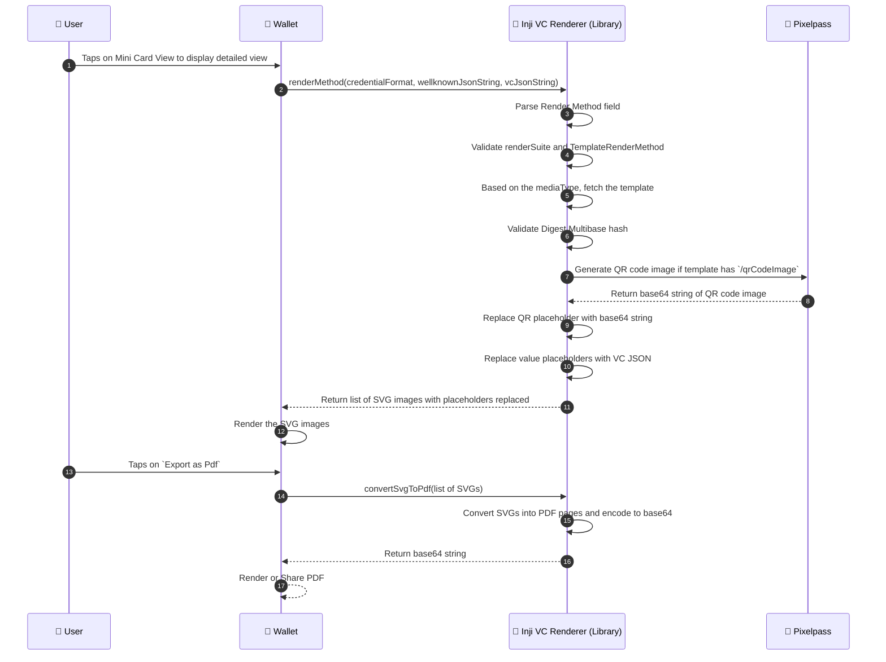

## InjiVcRenderer Library Flow

This document explains how the Inji VC Renderer Library renders VC data into SVG templates in the Wallet and how to convert SVG into PDF.

### Actors involved
1. User
2. Wallet
3. Inji VC Renderer Library (Library for rendering VC using SVG templates)
4. Pixelpass (Library for generating QR code image)

###  Sequence diagram - Rendering VC and converting SVG to PDF



#### Steps involved
##### 1. Tap on Mini Card View
The User taps on the Mini Card View in the Wallet to see the detailed view of a Verifiable Credential (VC).

##### 2. Call renderMethod API
The Wallet calls the InjiVcRenderer library’s renderVC(credentialFormat, wellknownJsonString, vcJsonString) API with the required inputs.
````
InjiVcRenderer.renderVC(
    credentialFormat, 
    wellknownJsonString, 
    vcJsonString
): listOfSVGs

- credentialFormat: It is the format of the credential. Only for ldp_vc is supported.
- wellknownJsonString: It is the wellknown JSON data. Optional field.
- vcJsonString: It is the Verifiable Credential JSON data which has claim values to be replaced in the template.
Returns: It returns the list of rendered SVGs with all placeholders replaced.
````
##### 3. Parse the render method field
The library parses the renderMethod field from the VC and return it as renderMethodArray.

##### 4. Validate renderSuite and type
For each item in the renderMethodArray, the library validates the `renderSuite` and `type` fields
- Only `svg-mustache` is supported as renderSuite and `TemplateRenderMethod` is supported as type.

##### 5. Fetch template
The library fetches the SVG template based on the mediaType and validates its integrity using the provided Digest Multibase hash.
- If mediaType is `image/svg+xml`, it directly uses the SVG content.


##### 6. Validate Digest Multibase hash
- If `digestMultibase` field is present,  it computes the Digest Multibase hash of the extracted SVG and compares it with the provided hash to ensure integrity.
- If the hashes do not match, it throws an error to the consumer.

##### 7. Generate QR code image
- If the template contains a `{{/qrCodeImage}}` placeholder, the library calls Pixelpass to generate a QR code and substitutes the base64 QR image in the template.

##### 8. Pixelpass returns base64 string of QR code image
- Pixelpass library generates the QR code and returns the base64 string of the QR code image to the InjiVcRenderer library.

##### 9. QR Code replacement logic
- If the template contains a `{{/qrCodeImage}}` placeholder but the QR code generation fails, it replaces the placeholder with an fallback image.
- Note : It is mandatory to have <image id= "qrCodeImage" .../> tag in the SVG template for the QR code replacement to work.

##### 10. VC replacement logic
- If replacement for the VC Json placeholders are not found in the VC JSON, it falls back to `-`.
- If replacement for the VC Json placeholders are found in the VC JSON, it replaces them with the corresponding values from the VC JSON.

##### 11. Return rendered SVGs to Wallet
- The library returns a list of processed SVGs with all placeholders replaced.

##### 12. Render SVGs in Wallet
- The Wallet renders these SVGs to display the detailed VC view to the user.

##### 13. User wants to Export as PDF
The User taps on Export as PDF in the Wallet.

##### 14. Call convertSvgToPdf API
The Wallet calls the InjiVcRenderer library’s convertSvgToPdf(listOfSVGs) API with the rendered SVG list.
````
InjiVcRenderer.convertSvgToPdf(
    listOfSVGs
): String
- listOfSVGs: It is the list of rendered SVGs returned from the renderMethod API.
- Returns: It returns the base64 string of the generated PDF.
````

##### 15. Convert SVGs to PDF
The library converts each SVG into a PDF page, merges them into a document, and encodes the PDF into a base64 string.

##### 16. Return PDF to Wallet
- The library returns the base64-encoded PDF to the Wallet.

##### 17. Render or Share PDF
- The Wallet can then either display the PDF for preview or share it with other applications.
