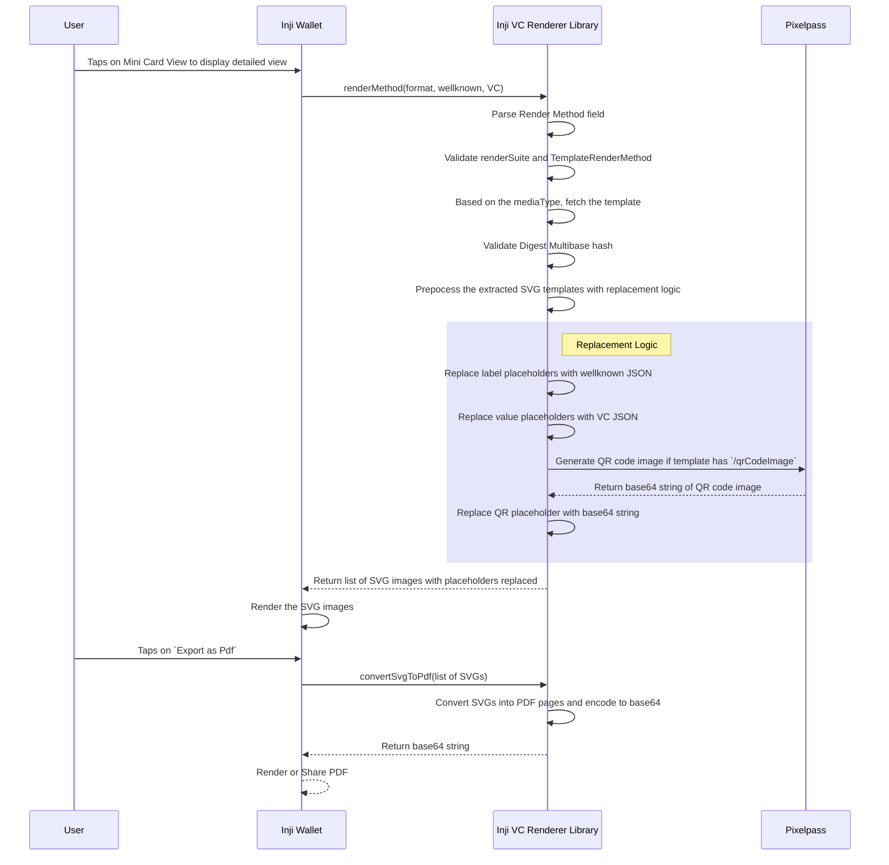

## InjiVcRenderer Library Flow

This document provides a comprehensive overview of the process for presenting the VC in Inji Wallet using gsthe Inji VC Renderer Library and the conversion of SVG to PDF.

### Actors involved
1. User
2. Inji Wallet
3. Inji VC Renderer Library (Library for rendering VC using SVG templates)
4. Pixelpass (Library for generating QR code image)

###  Sequence diagram - Rendering VC and converting SVG to PDF



#### Steps involved
##### 1. Tap on Mini Card View
The User taps on the Mini Card View in the Wallet to see the detailed view of a Verifiable Credential (VC).

##### 2. Call renderMethod API
The Wallet calls the InjiVcRenderer library’s renderVC(credentialFormat, wellknownJson, vcJson) API with the required inputs.
````
InjiVcRenderer.renderVC(
    credentialFormat, 
    wellknownJson, 
    vcJson
): listOfSVGs

- credentialFormat: It is the format of the credential. Only for ldp_vc is supported.
- wellknownJson: It is the wellknown JSON data which has label values to be replaced in the template.
- vcJson: It is the Verifiable Credential JSON data which has claim values to be replaced in the template.
Returns: It returns the list of rendered SVGs with all placeholders replaced.
````
##### 3. Parse and validate rendering metadata
The library parses the renderMethod field, validates the `renderSuite` and `type` fields
- Only `svg-mustache` is supported as renderSuite and `TemplateRenderMethod` is supported as type.

##### 4. Fetch and validate template
The library fetches the SVG template based on the mediaType and validates its integrity using the provided Digest Multibase hash.
- If mediaType is `application/xml`, it extracts the SVG content from the XML enclosed in <PageSet> tag.
- If mediaType is `image/svg+xml`, it directly uses the SVG content.
- It computes the Digest Multibase hash of the extracted SVG and compares it with the provided hash to ensure integrity.

##### 5. Preprocess SVG template
The library prepares the SVG template for rendering by running preprocessing logic:

###### QR code replacement logic
- If the template contains a `{{/qrCodeImage}}` placeholder, the library calls Pixelpass to generate a QR code and substitutes the base64 QR image in the template.
- If the template contains a `{{/qrCodeImage}}` placeholder but the QR code generation fails, it replaces the placeholder with an fallback image.
- Note : It is mandatory to have <image id= "qrCodeImage" .../> tag in the SVG template for the QR code replacement to work.
- 
###### Wellknown replacement logic
- If wellknown JSON is empty or null, it skips the label replacement step and if the template has the placeholders for wellknown like `{{/credential_definition/credentialSubject/fullName}}`, fallback replacement will be Full Name(Title Case).
- If wellknown JSON is present, it replaces the label placeholders in the template with corresponding values from the wellknown JSON.

###### VC replacement logic
- If replacement for the VC Json placeholders are not found in the VC JSON, it falls back to `-`.
- If replacement for the VC Json placeholders are found in the VC JSON, it replaces them with the corresponding values from the VC JSON.

##### 6. Return rendered SVGs to Wallet
- The library returns a list of processed SVGs with all placeholders replaced.
- The Wallet renders these SVGs to display the detailed VC view to the user.

##### 7. Tap on Export as PDF
The User taps on Export as PDF in the Wallet.

##### 8. Call convertSvgToPdf API
The Wallet calls the InjiVcRenderer library’s convertSvgToPdf(listOfSVGs) API with the rendered SVG list.
````
InjiVcRenderer.convertSvgToPdf(
    listOfSVGs
): String
- listOfSVGs: It is the list of rendered SVGs returned from the renderMethod API.
- Returns: It returns the base64 string of the generated PDF.
````

##### 9. Convert SVGs to PDF
The library converts each SVG into a PDF page, merges them into a document, and encodes the PDF into a base64 string.

##### 10. Return PDF to Wallet
- The library returns the base64-encoded PDF to the Wallet.
- The Wallet can then either display the PDF for preview or share it with other applications.
